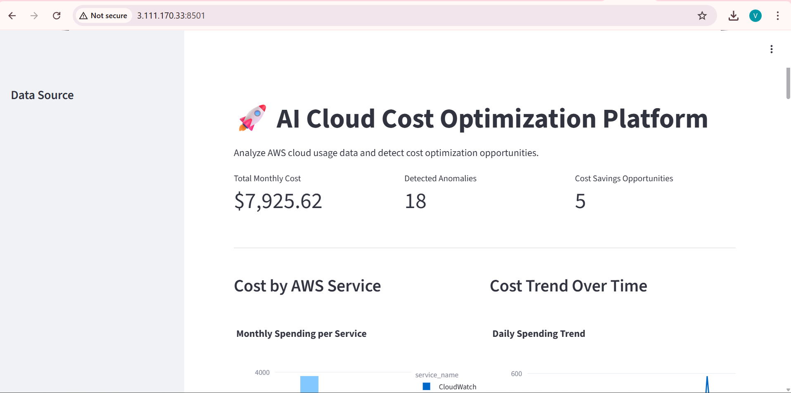
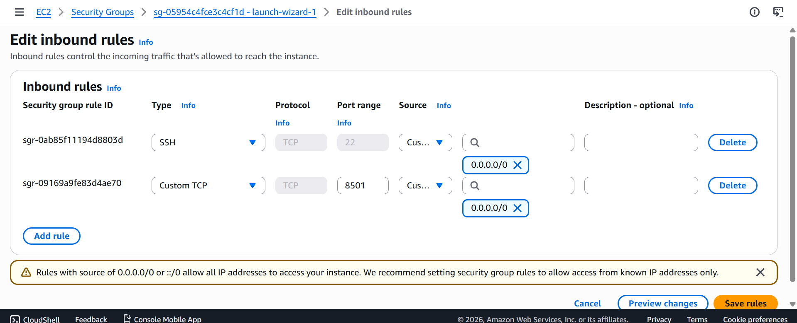
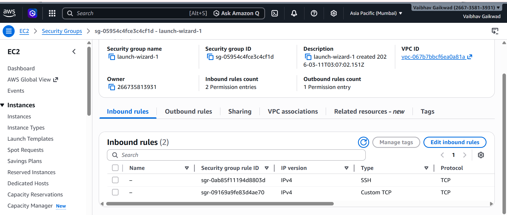
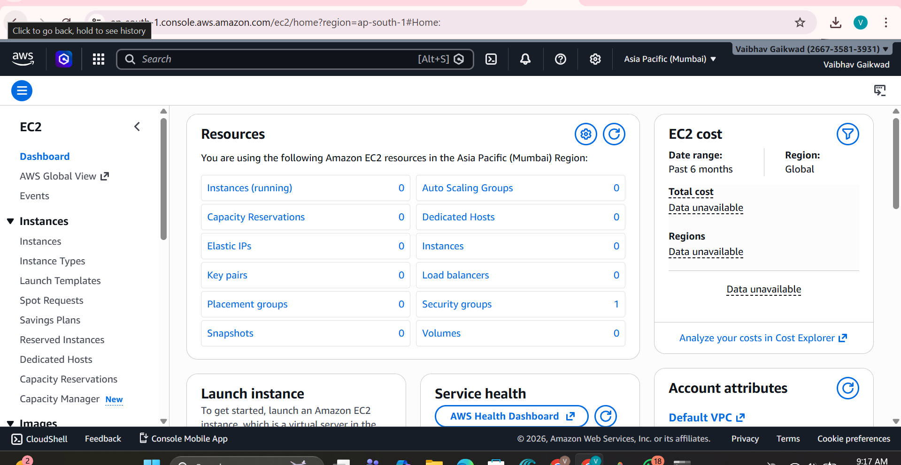

# AI Cloud Cost Optimization Platform

The AI Cloud Cost Optimizer is a powerful tool designed to analyze AWS cloud usage data and automatically detect cost optimization opportunities. It identifies idle resources, cost spikes, and provides actionable recommendations to reduce your monthly cloud bill.

## 🚀 Features

- **Data Ingestion**: Automatically fetches AWS cost data or generates high-fidelity sample datasets.
- **Cost Analysis**: Tracks total spending, breaks down costs by service, and detects daily trends.
- **Anomaly Detection**: Identifies unexpected cost spikes and idle resources (e.g., EC2 < 5% CPU).
- **AI Recommendation Engine**: Rule-based logic that suggests actions like stopping idle instances or moving data to Glacier.
- **Interactive Dashboard**: Beautiful UI built with Streamlit and Plotly for visual insights.

## 📁 Project Structure

```
ai-cloud-cost-optimizer
│
├── data/                    # Storage for cost datasets (CSV)
├── backend/                 # Core analysis and data processing logic
├── ai_engine/               # Recommendation engine and optimization rules
├── dashboard/               # Streamlit web application
├── Dockerfile               # Containerization config
├── docker-compose.yml       # Orchestration config
└── requirements.txt         # Python dependencies
```

## 🛠️ Installation & Setup

### Local Setup
1. Clone the repository.
2. Install dependencies:
   ```bash
   pip install -r requirements.txt
   ```
3. Run the dashboard:
   ```bash
   streamlit run dashboard/app.py
   ```

### Running with Docker
The easiest way to deploy is using Docker Compose:
```bash
docker-compose up --build
```
The dashboard will be available at `http://localhost:8501`.

## ☁️ AWS Deployment (EC2)
1. Launch an EC2 instance (Ubuntu recommended).
2. Install Docker and Docker Compose.
3. Clone this repo to the instance.
4. Run `docker-compose up -d`.
5. Ensure port `8501` is open in your Security Group.


## 📸 Deployment Process Screenshots

Here is the step-by-step process of deploying the platform to AWS:

### 1. EC2 Instance Configuration


### 2. SSH Connection & Docker Setup


### 3. Application Deployment


### 4. Final Dashboard Live


## 🤖 How it Works
1. **Backend**: Loads data from `data/sample_cost_data.csv` and uses Pandas to calculate metrics.
2. **AI Engine**: Scans the processed data for specific patterns (Low CPU, High Storage Cost, Sudden Spikes).
3. **Dashboard**: Renders the findings into interactive charts and detailed cards for user review.
